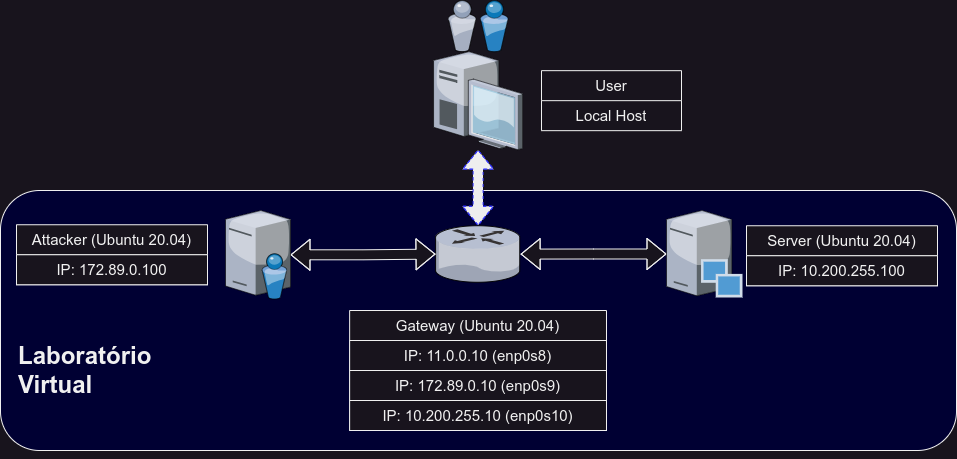
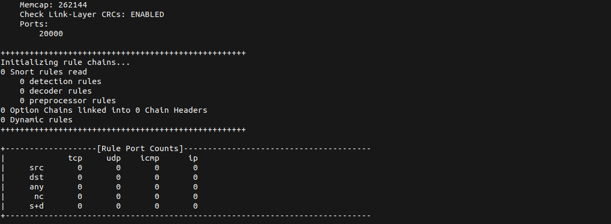

# IDS-DDoS-Sim

Repositório para a prática e simulações de Detecção de Intrusão sob ataques de Negação de Serviço Distribuídos (DDoS).

A motivação da criação desse repositório é ser um instrumento didático para práticas de laboratório computacional.[^*] 


## Laboratório Virtual

Nesse repositório é oferecido um ambiente controlado e isolado para a simulação dos ataques.

Foi levado em consideração a criação de um [*Passo a Passo*](https://github.com/pserpaschiavo/IDS-DDoS-Sim/blob/main/INSTALLATION.md#guia-para-instala%C3%A7%C3%A3o-do-virtualbox-e-do-vagrant) para usuários que possuem diferentes Sistemas Operacionais. 

Entretando, o grupo que criou esse repositório realizou os testes em computadores com o sistema operacional baseado em GNU/Linux.

### Estrutura do Laboratório Virtual

Após o processo de instalação, o usuário poderá verificar a seguinte estrutura de máquinas virtuais:



## Preparação e Configurações do Laboratório Virtual:
#### Pré-Requisitos:

> Nesta lista, estão citadas as aplicações utilizadas no projeto. Porém, fica a critério do usuário optar por outras apliacações de sua preferência.

- Virtual Box[^1]: https://www.virtualbox.org/
- Vagrant[^2]: https://www.vagrantup.com/
- Snort: https://www.snort.org/
- Hping3: https://www.kali.org/tools/hping3/


### Instalação do Virtualbox e do Vagrant:

- [Para usuários de Windows](https://github.com/pserpaschiavo/IDS-DDoS-Sim/blob/main/INSTALLATION.md#windows)
- [Para usuários de MacOS](https://github.com/pserpaschiavo/IDS-DDoS-Sim/blob/main/INSTALLATION.md#macos)
- [Para usários de Linux](https://github.com/pserpaschiavo/IDS-DDoS-Sim/blob/main/INSTALLATION.md#linux)

### Preparação das Máquinas Virtuais:

Após a instalação do **VirtualBox** e do **Vagrant**, siga as etapas abaixo:

Para fazer o dowload deste repositório, acesse a pasta de destino e digite o comando:

```
git clone https://github.com/pserpaschiavo/IDS-DDoS-Sim.git
```

Para *Hosts* com sistemas operacionais baseados em Linux e MacOS, faça a configuração dos blocos de IP's que estão configurados para o laboratório virtual:

```
cat <<EOF | sudo tee /etc/vbox/networks.conf
* 10.0.0.0/8 172.89.0.0/24 192.168.0.0/16 11.0.0.0/16
* 2001::/64
EOF
```

Agora, acesse o diretório do repositório e ative as máquinas virtuais:
```
vagrant up
```

Após o término do processo de ativação das máquinas virtuais, o usuário poderá fazer o acesso remoto através do comando:

```
vagrant ssh <nome-da-máquina-virtual>
```

### Instalação do **Snort**

Faça o acesso remoto no *Gateway*:
```
vagrant ssh gateway
```

Quando o acesso for realizado, digite o comando para a instalação do **Snort**:

```
sudo apt update && sudo apt install -y snort
```

Durante a instalação, será exibida uma tela para a identificação da interface de rede:

> No processo de instalação do **Snort**, serão exibidos na tela algumas interrupções pedindo informações sobre as interfaces e o bloco de IP's (*CIDR*). Nesse momento, é necessária a atenção para inserir as informações corretas e garantir o funcionamento do laboratório! 

- **Nome da Interface**: enp0s8 *(Primeiro pedido)*


- **Bloco de IP's/CIDR**: 10.200.255.0/24 *(Segundo pedido)*


- **Nome da Interface**: enp0s9 *(Terceiro pedido)*


Após a instalação, verifique se foi concluida com sucesso:

```
snort -V
```


Depois de verificar a instalação, faça o download das regras para o **Snort**[^4]:
```
wget https://raw.githubusercontent.com/pserpaschiavo/IDS-DDoS-Sim/refs/heads/main/lab-rules/lab_snort_rules.txt
```

Para inserir no arquivo `local.rules`:
```
cat lab_snort_rules.txt | sudo tee /etc/snort/rules/local.rules
```

Agora, digite o seguinte comando para configurar a interface no modo *"Promisc"*:
```
sudo ip link set enp0s8 promisc on
sudo ip link set enp0s10 promisc on
```

## Preparação do Ambiente de Simulações:

Na máquina virtual *Gateway*, acesse o arquivo `snort.conf`:

> Aqui é usado o **Vi/Vim Text Editor**. Entretanto, fique a vontade para usar o editor de texto de sua preferência.

```
sudo vi /etc/snort/snort.conf
```

Na linha 51, substitue o valor `ipvar HOME_NET any` por `ipvar HOME_NET 10.200.255.0/24`.

Assim, digite o comando a seguir para exibir o relatório das *rules* pré-configuradas.

```
sudo snort -T -i enp0s8 -c /etc/snort/snort.conf
```

> O **Snort** fará um relatório e exibirá na tela todas as informações configuradas. Algumas linhas informará ao usuário de regras duplicadas. Essas informações podem ser ignoradas nesse momento:


Como o objetivo do laboratório é didático, as regras já definidas serão desativadas para inclusão de novas a fim de demonstrar um cenário próprio do laboratório.

Para isso, as regras serão comentadas `#` entre as linhas 578 até a 696:

1. Acesse o arquivo `snort.conf` com o editor de texto Vi: `sudo vi /etc/snort/snort.conf`;

2. Digite a seguinte expressão: `:578,696s/^/#` e aperte a tecla *Enter*;

3. Salve o arquivo;

4. Execute o comando novamente:  

```
sudo snort -T -i enp0s8 -c /etc/snort/snort.conf
```

Confira se as alterações foram feitas:




Ainda com o *Gateway* conectado, abra um novo terminal e faça o acesso remoto na máquina *Attacker*:

```
vagrant ssh attacker
```


Acesse o link para a seção das [Simulações](https://github.com/pserpaschiavo/IDS-DDoS-Sim/blob/main/SIMULATION.md#simula%C3%A7%C3%B5es) para continuar...


### Vídeos:

 [Installing & Configuring Snort por *HackerSploit*](https://www.youtube.com/watch?v=U6xMp-MIEfA)

 [Intrusion Detection With Snort por *HackerSploit*](https://www.youtube.com/watch?v=Gh0sweT-G30)


[^1]: O usuário pode optar, de acordo com a sua preferência, por outros aplicativos para criar as Máquinas Virtuais.
[^2]: É oferecido um script *Vagrantfile* com o objetivo de criar o laboratório virtual com todas aplicações (com excessão do **Snort**) e dependencias já instaladas. Entretanto, o uso do Vargrant é facultativo.
[^*]: O uso inapropriado desse repositório é de responsabilidade do usuário.
[^4]: Regras disponíveis no tutorial feito por [Bryan Matthehew](https://medium.com/@bmatth21/detecting-ddos-attacks-and-port-scanning-techniques-with-snort-11e249a5eba9).
