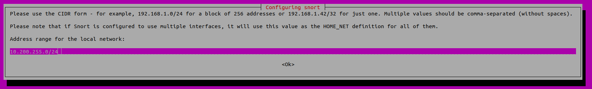

# IDS-DDoS-Sim

Repositório para a prática e simulações de Detecção de Intrusão sob ataques de Negação de Serviço Distribuídos (DDoS).

A motivação da criação desse repositório é ser um instrumento didático para práticas de laboratório computacional.[^*] 


## Laboratório Virtual

Nesse repositório é oferecido um ambiente controlado e isolado para a simulação dos ataques.

Foi levado em consideração a criação de um [*Passo a Passo*](https://github.com/pserpaschiavo/IDS-DDoS-Sim/blob/main/INSTALLATION.md#guia-para-instala%C3%A7%C3%A3o-do-virtualbox-e-do-vagrant) para usuários que possuem diferentes Sistemas Operacionais. 

Entretando, o grupo que criou esse repositório realizou os testes em computadores com o sistema operacional baseado em GNU/Linux.

### Estrutura do Laboratório Virtual

Após o processo de instalação, o usuário poderá verificar a seguinte estrutura de máquinas virtuais:


## Preparação e Configurações do Laboratório Virtual:
#### Pré-Requisitos:

> Nesta lista, estão citadas as aplicações utilizadas no projeto. Porém, fica a critério do usuário optar por outras apliacações de sua preferência.

- Virtual Box[^1]: https://www.virtualbox.org/
- Vagrant[^2]: https://www.vagrantup.com/
- Snort: https://www.snort.org/
- Hping3: https://www.kali.org/tools/hping3/


### Instalação do Virtualbox e do Vagrant:

- [Para usuários de Windows](https://github.com/pserpaschiavo/IDS-DDoS-Sim/blob/main/INSTALLATION.md#windows)
- [Para usuários de MacOS](https://github.com/pserpaschiavo/IDS-DDoS-Sim/blob/main/INSTALLATION.md#macos)
- [Para usários de Linux](https://github.com/pserpaschiavo/IDS-DDoS-Sim/blob/main/INSTALLATION.md#linux)

### Preparação das Máquinas Virtuais:

Após a instalação do **VirtualBox** e do **Vagrant**, siga as etapas abaixo:

Para fazer o dowload deste repositório, acesse a pasta de destino e digite o comando:

```
git clone https://github.com/pserpaschiavo/IDS-DDoS-Sim.git
```

Para *Hosts* com sistemas operacionais baseados em Linux e MacOS, faça a configuração dos blocos de IP's que estão configurados para o laboratório virtual:

```
cat <<EOF | sudo tee /etc/vbox/networks.conf
* 10.0.0.0/8 172.89.0.0/24 192.168.0.0/16 11.0.0.0/16
* 2001::/64
EOF
```

Agora, acesse o diretório do repositório e ative as máquinas virtuais:
```
vagrant up
```

Após o término do processo de ativação das máquinas virtuais, o usuário poderá fazer o acesso remoto através do comando:

```
vagrant ssh <nome-da-máquina-virtual>
```

### Instalação do **Snort**

Faça o acesso remoto no *Gateway*:
```
vagrant ssh gateway
```

Quando o acesso for realizado, digite o comando para a instalação do **Snort**:

```
sudo apt install -y snort 
```

Durante a instalação, será exibida uma tela para a identificação da interface de rede:

- **Nome da Interface**: enp0s8


- **Bloco de IP's/CIDR**: 10.0.0.0/24




Após a instalação, verifique se foi concluida com sucesso:

```
snort -V
```


Depois de verificar a instalação, faça o download das regras para o **Snort**[^4]:
```
wget https://raw.githubusercontent.com/pserpaschiavo/IDS-DDoS-Sim/refs/heads/main/rules/lab_snort_rules.txt
```

Para inserir no arquivo `local.rules`:
```
cat lab_snort_rules.txt | sudo tee /etc/snort/rules/local.rules
```

## Simulações:

Abra dois terminais e faça o acesso remoto nas máquinas *Attacker* e *Gateway*:

### Terminal-1

```
vagrant ssh attacker
```

### Terminal-2

```
vagrant ssh gateway
```

Para cada ataque realizado usando o **Hping3** *(Attacker)*, o usuário deve fazer alterações no arquivo de regras do **Snort** *(Gateway)*, retirando o caractere `#` no início da expressão do arquivo `/etc/snort/rules/local.rules`:
```
sudo nano /etc/snort/rules/local.rules
```

- Regra Desativada:

```
# alert udp any any -> $HOME_NET 53 (threshold: type threshold, track by_src, count 10, seconds 60; msg:”UDP FLOODING ATTACK”;sid:10000007;rev:2;)
```

- Regra Ativada:

```
alert udp any any -> $HOME_NET 53 (threshold: type threshold, track by_src, count 10, seconds 60; msg:”UDP FLOODING ATTACK”;sid:10000007;rev:2;)
```

### Realizando Ataques de Negação de Serviço Distribuído (DDoS) e Detectando-os:

Para monitorar os pacotes que atravessam o *Gateway*, é necessário usar o comando:
```


#### Land Attack

- Hping3: 

```
sudo hping3 -S 10.0.0.10 -a 10.0.0.10 -k -s 80 -p 80 --flood
```

- Snort Rule:

```
alert tcp $HOME_NET 80 <> $HOME_NET 80 (msg:”LAND ATTACK DETECTED”;sid:10000009;rev:3;)
```

#### SYN Flood Attack

- Hping3: 

```
sudo hping3 --rand-source 10.0.0.10 -p 80 -S --flood
```

- Snort Rule: 

```
alert tcp any any -> $HOME_NET 80 (threshold: type threshold, track by_dst, count 20, seconds 60; msg: “Possible TCP SYN Flood attack detected”; sid: 10000009; rev: 1;)
```

#### Smurf Attack

- Hping3: 

```
sudo hping3 -1 --icmptype 8 --icmpcode 0 -k --flood -a 10.0.0.10 192.168.0.255
```

- Snort Rule:

```
alert icmp $HOME_NET any -> 192.168.0.255 any (threshold: type threshold, track by_src, count 20, seconds 60;msg:”SMURF FLOODING ATTACK DETECTED”;sid:100000023;rev:1;)
```
    
#### UDP Flood Attack:

- Hping3: 

```
sudo hping3 -2 --flood --rand-source -p 53 10.0.0.10
```

- Snort Rule: 

```
alert udp any any -> $HOME_NET 53 (threshold: type threshold, track by_src, count 10, seconds 60; msg:”UDP FLOODING ATTACK”;sid:10000007;rev:2;)
```

### Realizando Scanner de Porta (*Port Scanning*) e Detectando-os:

#### TCP ACK Scan

- Hping3: 

```
sudo hping3 -V -p 80 -s 5050 -A 10.0.0.10 -k
```

- Snort Rule:

```
alert tcp $EXTERNAL_NET 5050 -> $HOME_NET 80 (threshold: type threshold, track by_dst, count 20, seconds 60; msg:”TCP SCAN DETECTED”;sid:10000007;rev:2;)
```

#### TCP FIN Scan

- Hping3:

```
sudo hping3 -V -p 80 -s 5050 -F 10.0.0.10 -k
```

- Snort Rule: 

```
alert tcp $EXTERNAL_NET 5050 -> $HOME_NET 80 (msg:”TCP FIN Scan Detected”; flags:F; threshold:type threshold, track by_src, count 20, seconds 60;classtype:attempted-recon; sid:10000001; rev:1;)
```


#### TCP NULL Scan

- Hping3: 

```
sudo hping3 -V -p 80 -s 5050 -Y 10.0.0.10 -k
```


- Snort Rule: 

```
alert tcp $EXTERNAL_NET 5050 -> $HOME_NET 80 (msg:”Null Scan Detected”; flags:0; threshold:type threshold, track by_src, count 20, seconds 60; classtype:attempted-recon; sid:1000002; rev:1;)
```

#### TCP XMAS Scan

- Hping3: 

```
sudo hping3 -V -p 80 -s 5050 -M 0 -UPF 10.0.0.10 -k
```

- Snort Rule: 

```
alert tcp $EXTERNAL_NET 5050 -> $HOME_NET 80 (msg:”Xmas Scan Detected”; flags:UPF; threshold:type threshold, track by_src, count 20, seconds 60; classtype:attempted-recon; sid:1000002; rev:1;)
```
#### TCP UDP Scan

- Hping3: 

```
sudo hping3 -2 10.0.0.10 -p 53
```

- Snort Rule: 

```
alert udp $EXTERNAL_NET any -> $HOME_NET 53 (msg:”UDP SCAN DETECTED”; threshold:type threshold, track by_dst, count 20, seconds 60; classtype:attempted-recon; sid:10000006;rev:1;)
```

### Vídeos:

 [[Cyber Security Project] Detecting DDOS Attacks and Port Scanning Techniques with Snort](https://www.youtube.com/watch?v=V7IQPRWobvQ&t=132s) 


[^1]: O usuário pode optar, de acordo com a sua preferência, por outros aplicativos para criar as Máquinas Virtuais.
[^2]: É oferecido um script *Vagrantfile* com o objetivo de criar o laboratório virtual com todas aplicações (com excessão do **Snort**) e dependencias já instaladas. Entretanto, o uso do Vargrant é facultativo.
[^*]: O uso inapropriado desse repositório é de responsabilidade do usuário.
