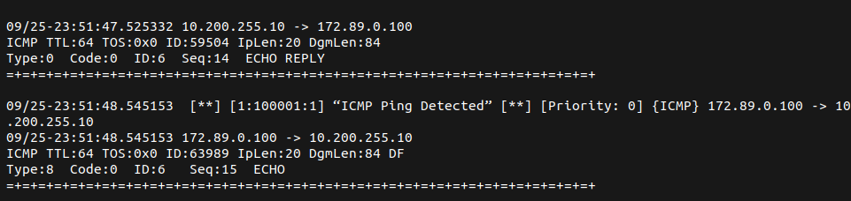

# Simulações

Para cada ataque realizado usando o **Hping3** *(Attacker)*, o usuário deve fazer alterações no arquivo de regras do **Snort** *(Gateway)*, retirando o caractere `#` no início da expressão do arquivo `/etc/snort/rules/local.rules`:

```
sudo vi /etc/snort/rules/local.rules
```

- *Gateway*:
- Regra Desativada:

```
# alert udp any any -> $HOME_NET 53 (threshold: type threshold, track by_src, count 10, seconds 60; msg:”UDP FLOODING ATTACK”;sid:10000007;rev:2;)
```

- Regra Ativada:

```
alert udp any any -> $HOME_NET 53 (threshold: type threshold, track by_src, count 10, seconds 60; msg:”UDP FLOODING ATTACK”;sid:10000007;rev:2;)
```

**Após descomentar a regra de interesse, o **Snort** deve ser ativado para exibir os alertas:**

```
sudo snort -q -l /var/log/snort -i enp0s8 -vbA console -c /etc/snort/snort.conf
```

## Testes preliminares:

### Ping Detection (Para Propósito de Testes):

- Ping Command:

```
ping 10.200.255.100
```

- Snort Rule:
```
alert icmp $EXTERNAL_NET any -> $HOME_NET any (msg: “ICMP Ping Detected”; sid: 100001; rev:1;)
```

Exemplo da saída:




## Realizando Ataques de Negação de Serviço Distribuído (DDoS) e Detectando-os:

Para monitorar os pacotes que atravessam o *Gateway*, é necessário usar o comando:
```
sudo snort 
```

#### Land Attack

- Hping3: 

```
sudo hping3 -S 10.0.0.10 -a 10.0.0.10 -k -s 80 -p 80 --flood
```

- Snort Rule:

```
alert tcp $HOME_NET 80 <> $HOME_NET 80 (msg:”LAND ATTACK DETECTED”;sid:10000009;rev:3;)
```

#### SYN Flood Attack

- Hping3: 

```
sudo hping3 --rand-source 10.0.0.10 -p 80 -S --flood
```

- Snort Rule: 

```
alert tcp any any -> $HOME_NET 80 (threshold: type threshold, track by_dst, count 20, seconds 60; msg: “Possible TCP SYN Flood attack detected”; sid: 10000009; rev: 1;)
```

#### Smurf Attack

- Hping3: 

```
sudo hping3 -1 --icmptype 8 --icmpcode 0 -k --flood -a 10.0.0.10 192.168.0.255
```

- Snort Rule:

```
alert icmp $HOME_NET any -> 192.168.0.255 any (threshold: type threshold, track by_src, count 20, seconds 60;msg:”SMURF FLOODING ATTACK DETECTED”;sid:100000023;rev:1;)
```
    
#### UDP Flood Attack:

- Hping3: 

```
sudo hping3 -2 --flood --rand-source -p 53 10.0.0.10
```

- Snort Rule: 

```
alert udp any any -> $HOME_NET 53 (threshold: type threshold, track by_src, count 10, seconds 60; msg:”UDP FLOODING ATTACK”;sid:10000007;rev:2;)
```

## Realizando Scanner de Porta (*Port Scanning*) e Detectando-os:

#### TCP ACK Scan

- Hping3: 

```
sudo hping3 -V -p 80 -s 5050 -A 10.0.0.10 -k
```

- Snort Rule:

```
alert tcp $EXTERNAL_NET 5050 -> $HOME_NET 80 (threshold: type threshold, track by_dst, count 20, seconds 60; msg:”TCP SCAN DETECTED”;sid:10000007;rev:2;)
```

#### TCP FIN Scan

- Hping3:

```
sudo hping3 -V -p 80 -s 5050 -F 10.0.0.10 -k
```

- Snort Rule: 

```
alert tcp $EXTERNAL_NET 5050 -> $HOME_NET 80 (msg:”TCP FIN Scan Detected”; flags:F; threshold:type threshold, track by_src, count 20, seconds 60;classtype:attempted-recon; sid:10000001; rev:1;)
```


#### TCP NULL Scan

- Hping3: 

```
sudo hping3 -V -p 80 -s 5050 -Y 10.0.0.10 -k
```


- Snort Rule: 

```
alert tcp $EXTERNAL_NET 5050 -> $HOME_NET 80 (msg:”Null Scan Detected”; flags:0; threshold:type threshold, track by_src, count 20, seconds 60; classtype:attempted-recon; sid:1000002; rev:1;)
```

#### TCP XMAS Scan

- Hping3: 

```
sudo hping3 -V -p 80 -s 5050 -M 0 -UPF 10.0.0.10 -k
```

- Snort Rule: 

```
alert tcp $EXTERNAL_NET 5050 -> $HOME_NET 80 (msg:”Xmas Scan Detected”; flags:UPF; threshold:type threshold, track by_src, count 20, seconds 60; classtype:attempted-recon; sid:1000002; rev:1;)
```
#### TCP UDP Scan

- Hping3: 

```
sudo hping3 -2 10.0.0.10 -p 53
```

- Snort Rule: 

```
alert udp $EXTERNAL_NET any -> $HOME_NET 53 (msg:”UDP SCAN DETECTED”; threshold:type threshold, track by_dst, count 20, seconds 60; classtype:attempted-recon; sid:10000006;rev:1;)
```